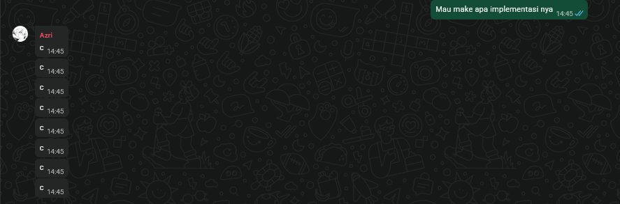

# The First Ancestral Race Networking System

Initial implementation status:
- Milestone 0 scaffold is runnable with `make run` or `./run.sh`.
- Core abstractions, topology registry, JSON load/save, and the interactive `TFAR>` prompt are implemented.
- Layer 2+ commands are present as stubs for now.

Kenapa pake C?

  
  <!-- gausah dibaca sampe sini juga mas -->

## Prerequisites & Setup

* clang, with C2Y support.
* make
* clang-format (Optional, for code formatting)
* Tested on Ubuntu 24.04 via WSL2.

## Cara Menjalankan Program

* a simple `make run` will execute the program in release mode.
* `make debug` will run the program with debug symbols and verbose logging.
* `make async` will run the program with asynchronous capabilities.
* `make clean` will remove all compiled objects and executables.

## Daftar Periksa Pencapaian (Milestones)

Centang (*checklist*) kotak di bawah ini sesuai dengan *layer* yang telah kelompok kalian selesaikan:

* [x] **Milestone 0: Fondasi Simulasi** - Pembuatan kelas fisik (*Interface*, *Link*), struktur dasar *Packet* yang mendukung konversi ke *byte* mentah, dan memuat topologi JSON.
* [x] **Milestone 1: Data Link Layer (L2)** - Implementasi *Ethernet Frame*, logika *Switching* (*VLAN-aware*), dan antrean IP Packet menggunakan *ARP Cache*.
* [x] **Milestone 2: Network Layer (L3)** - Implementasi resolusi *Longest Prefix Match Routing*, *Inter-VLAN Routing*, modifikasi parameter TTL, kalkulasi *Checksum* IPv4, dan pengiriman *ICMP Error Messages*.
* [x] **Milestone 3: Transport Layer (L4)** - Penyusunan *State Machine* TCP (*3-Way Handshake*, *Receive Buffers*, *4-Way Teardown*), protokol UDP, dan kalkulasi *Pseudo-Header*.
* [ ] **Milestone 4: Application Layer (L7)** - Pembuatan *Wrapper API* `MagiSocket` untuk mengabstraksi komunikasi OS, serta perakitan layanan mandiri DHCP, DNS, dan server HTTP.
* [ ] **Milestone 5: Fitur Bonus** - [Sebutkan fitur lanjutan yang kelompok Anda targetkan, misal: *Topology Visualizer*, *IP Fragmentation*, *ACL*, *NAT/PAT*, *RIPv2*, atau *Asynchronous Engine*].

## Pembagian Tugas

[Deskripsikan dengan jelas anggota kelompok dan *milestone* yang mereka kerjakan, ini wajib diisi sesuai instruksi pengumpulan repositori.]

* **Anggota 1 (NIM):** [Bagian yang dikerjakan]
* **Anggota 2 (NIM):** [Bagian yang dikerjakan]
* **Anggota 3 (NIM):** [Bagian yang dikerjakan]
* **Anggota 4/5 (NIM):** [Bagian yang dikerjakan]
